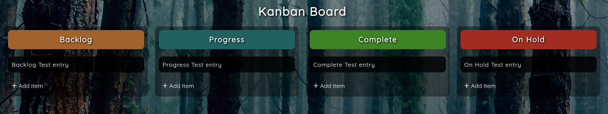
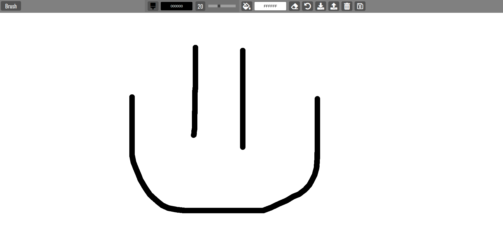
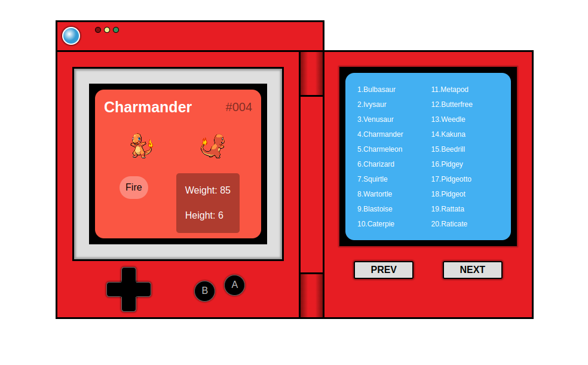

## basicJS

<table>
<tr>
    <th align="center">
        
        
 
            <small>
                Project
            </small>
        

    </th>
    <th align="center">
        
        
 
            <small>
                Image
            </small>
        

    </th>
    <th align="center">
        
        
 
            <small>
                Repository
            </small>
        

    </th>
    <th align="center">
        
        
 
            <small>
                Demo
            </small>
        

    </th>
</tr>
<tr>
    <td align="center"><strong>Kanban Board</strong></td>
    <td align="center"></td>
    <td align="center">
      
    </td>
    <td align="center">
      
    </td>
</tr>
<tr>
    <td align="center"><strong>Paint Clone</strong></td>
    <td align="center"></td>
    <td align="center">
      
    </td>
    <td align="center">
      
    </td>
</tr>
<tr>
    <td align="center"><strong>Pokedex Replica</strong></td>
    <td align="center"></td>
    <td align="center">
      
    </td>
    <td align="center">
      
    </td>
</tr>
</table>
